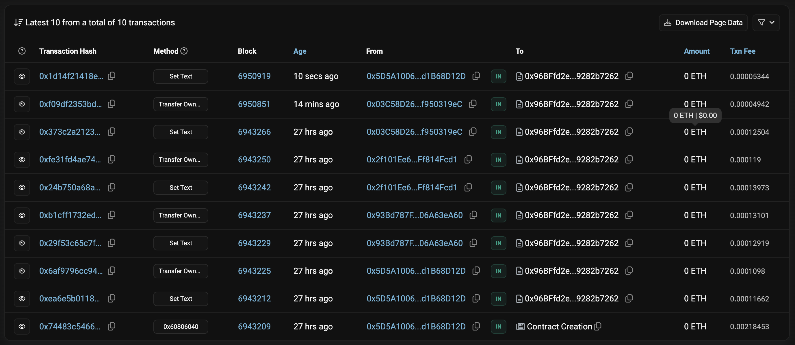

# Project 1 | EVM Bootcamp

## Requirements :

The requirements were detailed [here](https://encodeclub.notion.site/EVM-Bootcamp-Q4-2024-84ef51c6eb20450f8100729c2df48329) by the encode.club team as follows :

1. Form groups of 3 to 5 students [⤵️](#team-members-)
2. Interact with “[HelloWorld.sol](HelloWorld.sol)” within your group to change message strings and change owners [⤵️](#sepolia-etherscan-team-interaction-screenshot-)
3. Write a report with each function execution and the transaction hash, if successful, or the revert reason, if failed [⤵️](#report-table-)

---

## Team Members :

| Full Name       |  PUID  | Github @username                              |
| --------------- | ----   | -------------------------------------------- |
| Oladipo Evangel | fpLXIV | [@Evangel190](https://github.com/Evangel90)  |
| Victor Ukaegbu  | 4khHVL | [@victor-uk](https://github.com/victor-uk)   |
| Mario Youssef   | KyhHYQ | [@MariooY2](https://github.com/MariooY2)     |
| Tamir Omara     | Mganbg | [@tamiromara](https://github.com/tamiromara) |

---

## Sepolia Etherscan Team Interaction Screenshot :

---

## Report Table :

|     | **Action**           | **By**              | **TX Hash**                                                                                                           |
| --- | -------------------- | ------------------- | --------------------------------------------------------------------------------------------------------------------- |
| 1   | Contract Created     | Tamir               | [0x74483c5466...](https://sepolia.etherscan.io/tx/0x74483c54665ac108525c6fcaba7d084ffb2be07b587aad188d165edf9d27d535) |
| 2   | setText ( ) Called   | Tamir               | [0xea6e5b0118...](https://sepolia.etherscan.io/tx/0xea6e5b01186cfaf3ee39836948bfb02625dc09696e664c198dc7f3027a13ab1f) |
| 3   | Ownership Transfered | Tamir -to- Mario    | [0x6af9796cc9...](https://sepolia.etherscan.io/tx/0x6af9796cc945732164ab8eece5400172e3839ab5fae3f8d34a5936590e883f2d) |
| 4   | setText ( ) Called   | Mario               | [0x29f53c65c7...](https://sepolia.etherscan.io/tx/0x29f53c65c7f842a49c118e36918f14276342a39f75b97ec2e911c059b8c31401) |
| 5   | Ownership Transfered | Mario -to- Oladipo  | [0xb1cff1732e...](https://sepolia.etherscan.io/tx/0xb1cff1732ed06d72146168fb775f79cda7c34cf22f855fe9da8d97aec17b7eff) |
| 6   | setText ( ) Called   | Oladipo             | [0x24b750a68a...](https://sepolia.etherscan.io/tx/0x24b750a68a4386b4d327fa95cd8af818a49282689312bb22ad3b59837ce06853) |
| 7   | Ownership Transfered | Oladipo -to- Victor | [0xfe31fd4ae7...](https://sepolia.etherscan.io/tx/0xfe31fd4ae7430e5dc730031365b25fff43a350d7668081f88c2137b4559a8111) |
| 8   | setText ( ) Called   | Victor              | [0x373c2a2123...](https://sepolia.etherscan.io/tx/0x373c2a212370b322c22c3ce6df4432b0eeff35e06e211d3813235a33658caab4) |
| 9   | Ownership Transfered | Victor -to- Tamir   | [0xf09df2353b...](https://sepolia.etherscan.io/tx/0xf09df2353bd55523e92eee80d9e84de9850e7d9f192315277a33543af97f57cf) |
| 10  | setText ( ) Called   | Tamir               | [0x1d14f21418...](https://sepolia.etherscan.io/tx/0x1d14f21418e84bde5eecb1542a2722ffa4f39ff7f894689c8bd7b35abfec83e1) |

 
 

[⬆️ Back to the top ⬆️](#project-1--evm-bootcamp)
